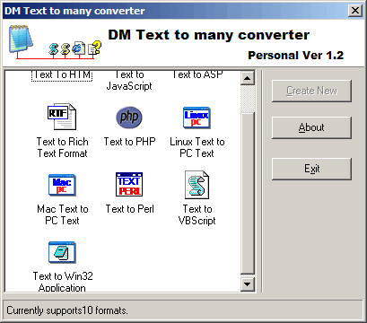



## DM Text to Many Converter Ver 1\.1

### Description

Hi This is an update to my Text to many converter

that will allow you as the devloper to convert text between many formats at the moment it now supports 10 formats.

 

I have also fixed the bugs with HTM and also php,javascript and many more. anyway some of the formats include:

Text to perl 

Text to Exe 

Text to Htm 

Text to Vbscript 

and many more please vote if you like this program plus please leave comments were inprovement can be make. apart form that I hope you like the code and that it helps someone.
 
### More Info
 

             |
---                |---
**Submitted On**   |2003-03-08 00:49:16
**By**             |[dreamvb](https://github.com/Planet-Source-Code/PSCIndex/blob/master/ByAuthor/dreamvb.md)
**Level**          |Intermediate
**User Rating**    |5.0 (10 globes from 2 users)
**Compatibility**  |VB 6\.0
**Category**       |[Complete Applications](https://github.com/Planet-Source-Code/PSCIndex/blob/master/ByCategory/complete-applications__1-27.md)
**World**          |[Visual Basic](https://github.com/Planet-Source-Code/PSCIndex/blob/master/ByWorld/visual-basic.md)
**Archive File**   |[DM\_Text\_to155633382003\.zip](https://github.com/Planet-Source-Code/dreamvb-dm-text-to-many-converter-ver-1-1__1-43836/archive/master.zip)

